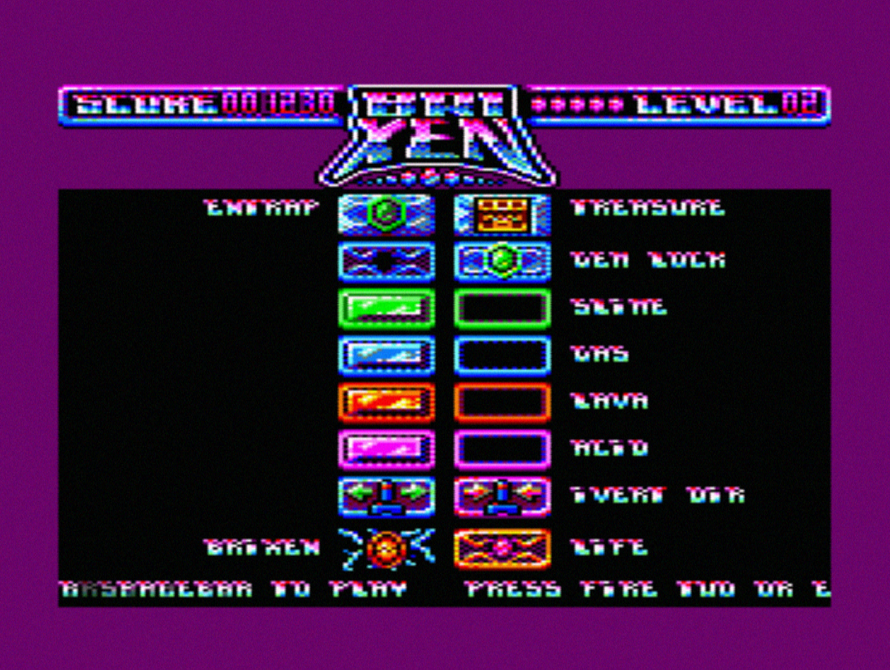

# BriXen

## Contrôles

### Dans le menu général:

**Espace** \(ou **fire1**\) pour commencer le jeu  
**Esc** \(ou **fire2**\) pour quitter vers le système 

### En cours de partie:

**Flèche** \(ou **stick**\) gauche/droite,  
Si vous êtes bloqué, vous avez été piégé, échappez vous avec la touche **esc** \(ou **fire2**\)

## Objectif du jeu

Détruisez toutes les cases pour pouvoir ouvrir les coffres \(attention, lorsque les coffres s'ouvrent, il ne le reste qu'un court moment\)

### Les briques

ENTRAP: ces briques doivent être détruites au tout début du jeu. Si vous touchez un interrupteur SLIME, GAS, LAVA ou ACID avant de les avoir détruites, la seule solution sera de vous suicider \(esc ou fire2\)

GEM LOCK: ces briques peuvent être considérées comme des clé/verrou. Vous touchez la GEM, votre boule la porte et permet d'ouvrir un des verrous.

SLIME, GAS, LAVA, ACID: ces briques ne peuvent être détruites qu'après avoir touché l'interrupteur correspondant.

INVERT DIR: inversion de direction de la balle. 

BRIXEN: la mort ! Ne le touchez pas !

LIFE: vie supplémentaire

## Conclusion

Amusez vous bien avec cette démo. Elle est constituée des 4 premiers niveaux du jeu qui en contiendra 32 dans sa version complète.

Le jeu est téléchargeable sur le site de [DoubleSided Games](https://doublesidedgames.com/cpc-gamedev-contest-entries)  \(préferez le test sur votre Amstrad CPC, ou à défaut via émulateur ou [en ligne](http://crocods.org/web/?url=brixen.cpr)\).

Et n'oubliez pas, [votez](https://www.facebook.com/groups/1120607071477318/permalink/1515515435319811/) pour nous !

[https://www.facebook.com/groups/1120607071477318/permalink/1515515435319811/](https://www.facebook.com/groups/1120607071477318/permalink/1515515435319811/)

